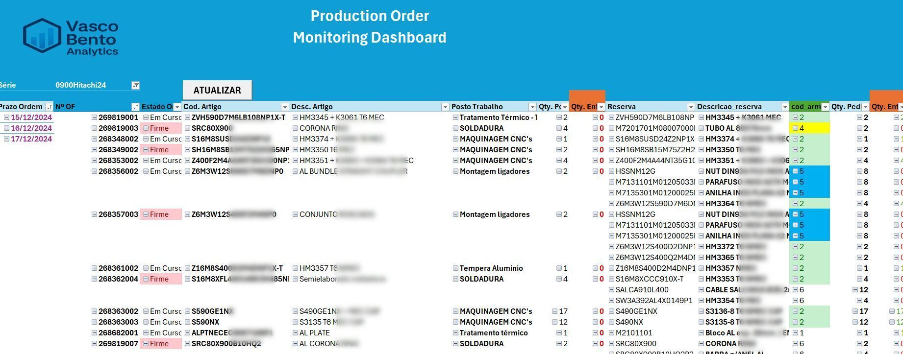

# Production Order Monitoring Dashboard

 **Description**  
An Excel (Power Pivot) based dashboard designed to monitor production orders (OF - "Ordens de Fabrico") in real time. It supports dynamic filtering by series, due dates, and order status, offering clear visibility over work center progress and material reservations.

---

 **Key Features**
- Detailed tracking by order number, due date, and work center
- Visual follow-up of material reservations and quantities delivered
- Color-coded alerts for incomplete deliveries
- Filtering by series and production status (Firm / In Progress)
- Integrated refresh button (VBA-powered)
- Built-in structure for SQL Server connection (not included in demo)

---

 **Tech Stack**
- Microsoft Power Pivot
  - Power Query (for data load)
  - VBA (for refresh automation)
- SQL Server backend (not public)

---
**Data Disclaimer**
All values are masked to protect confidentiality.
Real data has been transformed using consistent proportional logic.
The visual and logical structure remains representative of real-world business scenarios.
---

📷 **Screenshot**

---

👤 **Author**
[Vasco Bento](https://www.linkedin.com/in/vasco--bento)

---
